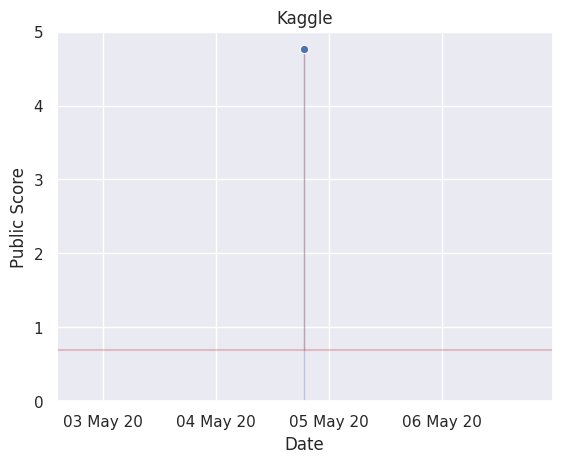

<!--suppress HtmlDeprecatedAttribute | JetBrains Inspection -->

    

<h1 align="center">Bike Sharing Demand</h1> 

    
    
    

This project proposes machine learning models to forecast bike rental demand in 
Washinton's [Capital Bikeshare](https://www.capitalbikeshare.com/) program.
Predictions are being submitted to Kaggle's
*[Bike Sharing Demand](https://www.kaggle.com/c/bike-sharing-demand/overview)* competition.

The project's scope was limited to exploring how far one could get with various 
feature engineering strategies in conjunction with linear regressions.

    

## Data

The data is to be found in [`data/original`](data/original) and was downloaded from 
[Kaggle](https://www.kaggle.com/c/bike-sharing-demand/data) on the *04.05.20*. It consists 
of a time series containing various information on the type of day and weather conditions.

The data is split up into: 

- [`train.csv`](data/original/train.csv) which comprises the first 19 days of each month, for which 
the number of bike rentals is known.
- [`test.csv`](data/original/train.csv) which comprises the days following the 
20th of each month, for which the number of bike rentals is unknown and should be predicted.
